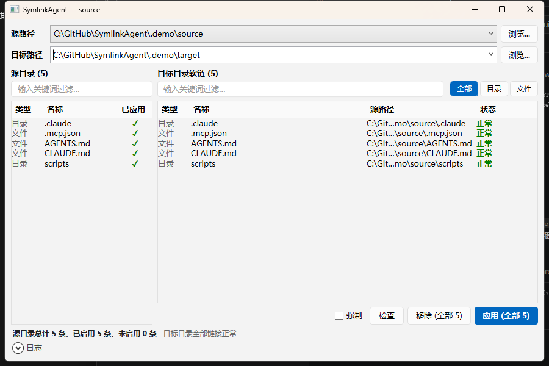
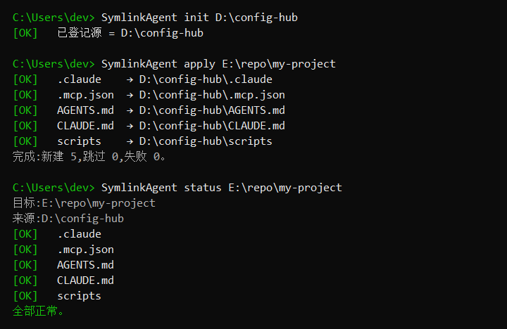

# SymlinkAgent

<p align="center">
<b>Windows 通用符号链接管理器</b><br/>
一个源目录 · 一键链接到所有目标 · 目标目录零实体文件
</p>

<p align="center">

</p>

---

## 这是什么

SymlinkAgent 解决一个具体问题:你在多个目录里都要用到相同的配置文件(`.mcp.json`、`.claude/`、`CLAUDE.md`、自定义脚本等),但不想在每个目录里都维护一份拷贝。

做法很简单:把所有需要共享的内容放进一个**源目录**,用文件资源管理器直接管理;SymlinkAgent 负责把它们以**符号链接**的方式挂到各个目标目录。目标目录始终保持干净——只有链接、没有实体文件。

```
源目录/                     目标A/                  目标B/
├─ .claude/          ──→    ├── .claude/ (链接)     ├── .claude/ (链接)
├─ .mcp.json         ──→    ├── .mcp.json (链接)    ├── .mcp.json (链接)
├─ AGENTS.md         ──→    ├── AGENTS.md (链接)    ├── AGENTS.md (链接)
└─ CLAUDE.md         ──→    └── src/...             ├── CLAUDE.md (链接)
                                                     └── src/...
```

**核心约定**:源目录顶层的每个文件/目录,自动成为一个链接条目——无需任何清单或配置文件(约定优于配置)。

## 特性

- **约定优于配置** —— 源顶层的文件/目录就是要链接的条目,零清单
- **安全撤销** —— 双重核查(记录优先 + 目录扫描),只删自己创建的链接,真实文件绝不触碰
- **绿色便携** —— 所有数据存在 EXE 旁的单个 INI 文件,不写注册表、不写 `%APPDATA%`,整个文件夹拷走即用
- **CLI + GUI** —— 命令行与图形界面共用同一核心引擎,两个 EXE 放同目录自动共享数据
- **逐条可控** —— 既能一键应用/移除全部,也能在界面里多选或右键操作单条
- **SVN 友好** —— 自动维护 `svn:ignore`,链接不被工作副本误纳管;非 SVN 环境静默跳过
- **原生链接** —— 使用 .NET 原生 symbolic link,不依赖 `mklink`、不调用 shell

## 两种用法

SymlinkAgent 提供**图形界面**和**命令行**两个独立 EXE,共用同一核心引擎与同一份数据。喜欢点按就用 GUI,要写脚本/批处理就用 CLI,两者效果完全一致。

### 图形界面(GUI)

界面分为"源(提供什么)→ 目标(现状如何)→ 操作"三段:

<p align="center">

</p>

- **顶部** —— `源路径` 与 `目标路径` 两个下拉,选定要操作的源与目标
- **左侧「源目录」** —— 当前源顶层会被链接的条目,`已应用` 列用 ✓ 标出哪些已正常链接到当前目标
- **右侧「目标目录软链」** —— 目标里现有链接的实时状态(`正常 / 缺失 / 失效 / 指向变了`)
- **底部操作** —— `强制`、`检查`、`移除`、`应用`;有多选时只作用选中行,否则作用全部
- **状态栏** —— 左侧概览源(总计/已启用/未启用),右侧概览目标链接健康度

### 命令行(CLI)

<p align="center">

</p>

```bash
# 1. 把某个文件夹登记为源目录
SymlinkAgent init D:\config-hub

# 2. 把它的内容链接到目标目录
SymlinkAgent apply E:\repo\my-project

# 3. 检查链接状态
SymlinkAgent status E:\repo\my-project

# 4. 需要时一键移除(只删链接,不动真实文件)
SymlinkAgent remove E:\repo\my-project
```

## 安装

### 直接下载

仓库 [`dist/`](dist) 目录内就是两个可直接运行的 EXE(免安装、免 .NET 运行时):

| 文件 | 说明 |
|---|---|
| `SymlinkAgent.exe` | 命令行版本(NativeAOT 原生单文件,约 2 MB) |
| `SymlinkAgentGui.exe` | 图形界面版本(自包含单文件,约 63 MB) |

下载后放在同一目录即可——它们会自动共享同目录下的 `SymlinkAgent.ini`(与 EXE 同级)。

> 全程需要管理员权限(创建符号链接的系统要求)。两个 EXE 都内嵌了 `requireAdministrator` 清单,运行时会触发 UAC 提权。

### 从源码构建

需要 [.NET 8 SDK](https://dotnet.microsoft.com/download/dotnet/8.0)。所有发布参数已固化进各工程 `.csproj`,直接 publish 即可:

```bash
git clone https://github.com/yourname/SymlinkAgent.git
cd SymlinkAgent

# GUI:普通终端即可
dotnet publish src/SymlinkAgent.Gui -c Release -o dist

# CLI:走 NativeAOT,链接阶段需 MSVC 工具链 + vswhere 在 PATH
#   先把 VS Installer 目录加进 PATH,再 publish:
#   PowerShell> $env:PATH = "C:\Program Files (x86)\Microsoft Visual Studio\Installer;$env:PATH"
dotnet publish src/SymlinkAgent.Cli -c Release -o dist
```

产物在 `dist/`:两个干净的单文件 EXE。

> **为什么 CLI 要这么构建**:CLI 用 NativeAOT 编译为原生码(体积约 2 MB、启动近乎瞬时),链接阶段依赖 Visual Studio 2022 的 C++ 工具集;GUI 因 WPF 不支持裁剪/AOT,采用"自包含 + 单文件 + 压缩"。详见 [CLAUDE.md](CLAUDE.md) 的构建章节。

## 快速上手

### 图形界面

1. 双击 `SymlinkAgentGui.exe`(首次运行会触发 UAC 提权)
2. 点击 `源路径` 旁的 **浏览…** 选择源文件夹 —— 左侧立即列出将被链接的条目
3. 在 `目标路径` 输入或选择目标目录 —— 停顿片刻自动检查,右侧显示链接现状
4. 点 **应用** 创建链接、**检查** 重新核查、**移除** 撤销链接

### 命令行

```bash
SymlinkAgent init   D:\config-hub          # 登记源
SymlinkAgent apply  E:\repo\my-project      # 链接到目标
SymlinkAgent status E:\repo\my-project      # 检查状态
SymlinkAgent remove E:\repo\my-project      # 撤销链接
```

> CLI 与 GUI 放在同一目录,自动共享同一份数据;用哪个操作效果完全一致。

## GUI 使用详解

**选中驱动操作**
- 在「目标目录软链」里多选若干行,底部按钮变为 `应用 (选中 N)` / `移除 (选中 N)`,只作用选中行;不选则作用全部。
- 点列表下方空白处可清除选中。

**右键单条操作**(左右两侧菜单结构一致)
- `应用此条` / `移除此条` —— 按"已应用"状态智能启用/禁用:已正常链接的条目不再可"应用",未链接的条目不可"移除"。
- `在资源管理器中打开`、`复制名称 / 源路径`(右侧额外有 `复制目标路径`、`复制全部状态`)。

**搜索与过滤**
- 顶部搜索框实时过滤,左右两侧联动;`全部 / 目录 / 文件` 按类型筛选右侧。

**安全确认**
- `移除` 与勾选 `强制` 后的操作都会二次确认;`强制` 用后自动取消,不会粘滞。

**键盘快捷键**

| 快捷键 | 作用 |
|---|---|
| `Ctrl+F` | 聚焦搜索框 |
| `Esc` | 清空搜索 |
| `F5` | 重新检查 |
| `Enter`(目标框) | 立即检查 |
| `Delete`(选中行) | 移除选中 |

## 命令一览(CLI)

| 命令 | 说明 |
|---|---|
| `init <源路径>` | 把文件夹登记为源目录 |
| `apply <目标目录> [--force]` | 把源目录内容链接到目标目录 |
| `remove <目标目录> [--force]` | 移除本工具创建的链接 |
| `status <目标目录>` | 检查链接状态 |
| `list` | 列出源目录内容与已应用目标 |
| `doctor <目标目录> [--fix]` | 诊断并(可选)修复链接状态 |

## 安全设计

SymlinkAgent 的核心原则是**只做链接、绝不碰真实数据**:

- **创建时**:目标已存在即报冲突;`--force`(GUI 的 `强制`)只覆盖旧链接,真实文件/目录永远拒绝覆盖
- **删除时**:只删记录在案的链接;删除前再核查是否仍为预期链接;目录链接用非递归删除,绝不触碰源内容
- **核查时**:记录优先 + 目录扫描双保险,输出 `正常 / 缺失 / 失效 / 指向变了`

## 技术架构

拆为三个工程:**Core 引擎 + CLI 壳 + GUI 壳**。业务逻辑只在 Core,CLI/GUI 都是薄壳。

```
SymlinkAgent.sln
src/
├─ SymlinkAgent.Core/   核心引擎(无 UI 依赖)
│  ├─ TargetEngine       编排:应用/移除/检查,返回结构化结果(支持按名子集操作)
│  ├─ SourceScanner      扫描源顶层,推导链接条目
│  ├─ DataStore          单一 INI 文件读写(配置+历史+记录)
│  ├─ LinkService        .NET 原生 symbolic link 封装
│  ├─ Verifier           链接状态核查(state-first + scan-second)
│  └─ SvnIgnoreService   SVN 忽略维护
├─ SymlinkAgent.Cli/    命令行壳 → SymlinkAgent.exe
└─ SymlinkAgent.Gui/    WPF 图形壳 → SymlinkAgentGui.exe
```

CLI 命令与 GUI 视图模型都是 `TargetEngine` 的薄壳,业务逻辑只有一份。更多设计约定见 [CLAUDE.md](CLAUDE.md)。

## 许可

[MIT](LICENSE)
